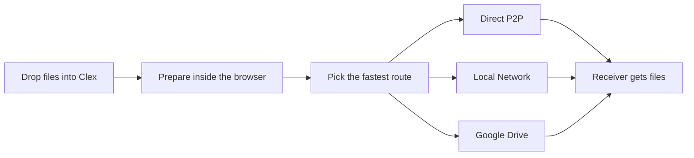
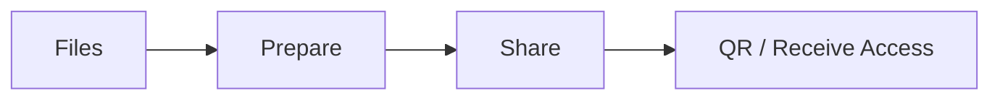

# Clex

<p align="center">
  
</p>

<p align="center">
  <strong>Drop. Prepare. Share.</strong><br />
  A privacy-first file workspace for direct transfer, local network delivery, and Google Drive fallback.
</p>

<p align="center">
  <a href="https://clex.in"></a>
  
  
  
</p>

---

## What Clex Is

| Drop | Prepare | Share |
| --- | --- | --- |
| Bring files into one browser workspace. | Compress images, convert formats, merge PDFs, split PDFs, bundle ZIPs. | Send directly, use same-Wi-Fi local transfer, or fall back to your own Google Drive. |

---

## Product Flow



---

## What The Experience Feels Like

- One workspace instead of five disconnected utilities.
- Privacy-first transfer where files do not pass through Clex servers.
- Tool chaining that turns `Compress -> Convert -> Bundle -> Share` into one continuous motion.
- Mobile-friendly receive flow with QR, room code, progress, ETA, and manual save fallback.
- Product UI that stays fast, local, and lightweight even when network conditions change.

---

## Routes At A Glance

| Route | Purpose | Notes |
| --- | --- | --- |
| `Direct P2P` | Fast browser-to-browser transfer | Best when direct WebRTC can be established |
| `Local Network` | Same-Wi-Fi transfer | Fastest when both devices are nearby |
| `Google Drive` | Reliable cloud fallback | Uploads into a dated `Glex sharing` folder in the user’s Drive |

| Constraint | Current behavior |
| --- | --- |
| Server storage | None for P2P/local |
| File limits | Browser RAM / device limits |
| Drive fallback | Uses the user’s Google Drive quota |
| Offline tools | Available after the app loads |

---

## Workspace Layout



- **Files**: drag in assets, manage the current set, clear, reorder through the working surface.
- **Prepare**: run the browser-native toolchain without leaving the tab.
- **Share**: choose direct, local, or Drive and start the handoff.
- **QR / Receive Access**: room code and QR stay visible so the receiver can join immediately.

---

## Repository Map

```text
.
├── frontend-2/            # Primary shipped frontend for clex.in
├── packages/frontend-core # Shared Svelte runtime, workspace, receive flow, mocks, stores
├── apps/api/              # Google Drive OAuth + upload worker
├── apps/signaling/        # WebRTC signaling worker
└── archive/old-frontend/  # Archived legacy SvelteKit frontend kept as reference
```

---

## Stack

- **Frontend**: Vite, Svelte islands, shared `@clex/frontend-core`
- **Transfer**: WebRTC + LAN-aware routing
- **Fallback delivery**: Google Drive OAuth + Drive file upload
- **Backend workers**: Cloudflare Workers + Cloudflare Pages
- **Tooling**: browser-side image, PDF, Word, ZIP operations

---

## Local Development

```bash
pnpm install
pnpm dev
```

Useful focused commands:

```bash
pnpm dev:frontend
pnpm dev:web
pnpm dev:api
pnpm dev:signal
```

`pnpm dev:web` is kept as a compatibility alias and starts the same `frontend-2` app as `pnpm dev:frontend`.

Builds:

```bash
pnpm --filter @clex/frontend-core build
pnpm --filter @clex/frontend build
pnpm --filter @clex/api build
pnpm --filter @clex/signaling build
```

---

## Production Surfaces

- **Marketing + workspace**: [clex.in](https://clex.in)
- **Receive flow**: [clex.in/receive](https://clex.in/receive)
- **Features**: [clex.in/features](https://clex.in/features)
- **How it works**: [clex.in/how-it-works](https://clex.in/how-it-works)
- **Signaling health**: [signal.clex.in/health](https://signal.clex.in/health)

---

## Why This Repo Exists

Clex is built to feel like a product, not a demo:

- the website and the workspace share the same visual language
- the transfer logic is reusable across marketing previews and real flows
- the backend is small and purposeful
- the user stays in control of storage, routing, and delivery

If you are reading this as a developer, the quickest way to understand the product is:

1. Open the live site.
2. Go to the workspace.
3. Drop a file.
4. Run a tool.
5. Send it through one of the three routes.

That is the whole idea.
