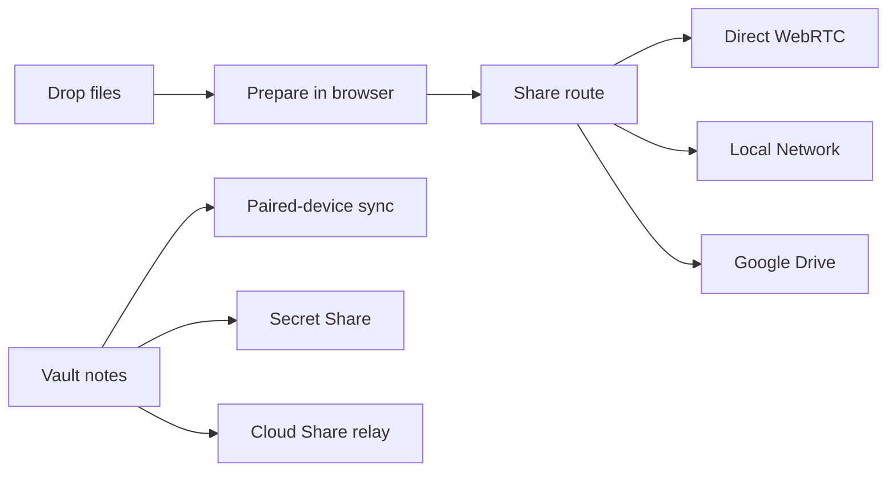

# Clex

<p align="center">
  
</p>

<p align="center">
  <strong>Drop. Prepare. Share.</strong><br />
  A privacy-first browser workspace for file transfer and browser-native tools, plus Vault for encrypted notes, secret links, and timed relay handoff.
</p>

<p align="center">
  <a href="https://clex.in"></a>
  
  
  
</p>

---

## What Clex Ships

### Workspace
- Drop files into one browser workspace.
- Run browser-side tools like image compression, format conversion, PDF merge/split, ZIP creation, and more.
- Share through direct WebRTC, same-network delivery, or Google Drive fallback.

### Vault
- Keep encrypted notes primarily on-device.
- Sync paired devices over the shared Vault room with manual sync support.
- Create secret links with selectable protections and timed expiry.
- Publish timed Cloud Share links with QR, direct link, and relay code handoff.

### Public site
- Landing, features, how-it-works, getting-started, chain, FAQ, privacy, and terms all live in the same frontend and visual system.

---

## Product Surfaces

| Route | Purpose |
| --- | --- |
| `/` | Marketing landing page |
| `/workspace` | Main file workspace |
| `/receive` | Receive flow for shared files |
| `/vault` | Vault app shell |
| `/vault/secret` | Secret reveal page |
| `/vault/share` | Timed file receive page |
| `/features` | Feature overview |
| `/how-it-works` | Transfer and Vault walkthrough |
| `/getting-started` | Onboarding flow |
| `/chain` | Public transfer-chain explorer |
| `/faq` | Product FAQ |
| `/privacy` | Privacy policy |
| `/terms` | Terms of use |

Production:
- Marketing + app: [clex.in](https://clex.in)
- Workspace: [clex.in/workspace](https://clex.in/workspace)
- Vault: [clex.in/vault](https://clex.in/vault)
- Receive: [clex.in/receive](https://clex.in/receive)
- Chain: [clex.in/chain](https://clex.in/chain)
- Signaling health: [signal.clex.in/health](https://signal.clex.in/health)

---

## Workspace and Vault Model



Important boundaries:
- Workspace transfers are designed to avoid server-side file storage whenever possible.
- Vault notes are local-first and encrypted before persistence.
- Vault secret payloads are encrypted client-side; the key is intended to stay in the URL fragment or reveal code.
- Vault Cloud Share is the exception: it uses a timed relay backed by Supabase storage and Cloudflare Worker metadata.
- The public Transfer Chain is for workspace transfer metadata, not Vault note content or Vault secret/file payloads.

---

## Vault Limits and Behavior

- Notes are stored locally and encrypted before persistence.
- Paired devices can sync through the shared Vault room when both are online.
- Secret Share supports timed expiry plus selectable protections such as view-once, timed view, no-select, tab-switch lock, DevTools guard, and screenshot guard.
- Cloud Share currently uses:
  - `10 MB` max per file
  - `100 MB` per user per day
  - `24h` auto-delete
  - Google sign-in for ownership and quota enforcement

---

## Monorepo Layout

```text
.
├── frontend-2/                # MPA frontend shipped to clex.in
├── packages/frontend-core/    # Shared Svelte runtime, workspace, Vault, landing components, stores
├── apps/api/                  # Google Drive auth/upload worker
├── apps/signaling/            # WebRTC signaling worker
├── apps/chain/                # Public transfer-chain worker
├── apps/vault-worker/         # Vault API worker: secrets, pairing, relay files, health
└── archive/old-frontend/      # Archived legacy frontend reference
```

---

## Stack

- Frontend: Vite, Svelte, shared `@clex/frontend-core`
- Workspace transfer: WebRTC, same-network routing, Google Drive fallback
- Vault sync: Yjs, `y-webrtc`, `y-indexeddb`
- Backend: Cloudflare Pages + Cloudflare Workers
- Vault relay storage: Supabase Storage + D1 + KV
- Tests: Vitest

---

## Requirements

- Node.js `>=20`
- pnpm `>=9`

Install once:

```bash
pnpm install
```

---

## Local Development

Run the main local stack:

```bash
pnpm dev
```

Useful focused commands:

```bash
pnpm dev:frontend
pnpm dev:web
pnpm dev:signal
pnpm dev:api
pnpm dev:chain
pnpm --filter @clex/vault-worker dev
```

What each one does:
- `pnpm dev` starts the frontend, signaling worker, API worker, and chain worker in parallel.
- `pnpm dev:frontend` and `pnpm dev:web` both run `frontend-2`.
- `pnpm --filter @clex/vault-worker dev` runs the Vault API worker separately.

Frontend environment:

```bash
cp frontend-2/.env.example frontend-2/.env.local
```

Default local ports:
- Frontend: `3000`
- Signaling worker: `8787`
- API worker: `8788`
- Chain worker: `8789`

Note about Vault locally:
- The Vault UI is served by `frontend-2`, but its secret, pairing, and Cloud Share APIs live in `apps/vault-worker`.
- The frontend expects Vault APIs on `/vault/api/*` in production.
- For full local Vault flows, you need the Vault worker running and routed appropriately for the environment you are testing.

---

## Build and Verification

Main build:

```bash
pnpm build
```

Useful checks:

```bash
pnpm test
pnpm typecheck
pnpm --filter @clex/frontend build
pnpm --filter @clex/frontend-core typecheck
pnpm --filter @clex/vault-worker exec tsc --noEmit
```

Worker-specific commands:

```bash
pnpm --filter @clex/vault-worker build
pnpm --filter @clex/vault-worker deploy
pnpm --filter @clex/vault-worker db:migrate
```

---

## Deployment Notes

- `frontend-2` builds the static site and app shell.
- `apps/signaling`, `apps/api`, `apps/chain`, and `apps/vault-worker` deploy independently as Cloudflare Workers.
- The Vault worker is expected to serve `/vault/api/*` on production.
- Vault Cloud Share requires Supabase secrets and storage bucket configuration in the worker environment.

Vault worker bindings currently include:
- KV for secrets, pairing signals, tokens, and daily quotas
- D1 for relay metadata and pending deletions
- Supabase secrets for timed file relay storage

---

## Why This Repo Exists

Clex is meant to feel like one product system, not a pile of separate demos:

- the landing site and the apps share the same visual language
- the workspace and Vault sit in the same frontend shell
- transfer routes and Vault flows are treated as product surfaces, not side experiments
- the backend stays narrow and task-specific

The fastest way to understand the repo is:

1. Open [clex.in](https://clex.in)
2. Try the Workspace at `/workspace`
3. Try Vault at `/vault`
4. Look at `packages/frontend-core` for shared runtime logic
5. Look at `apps/*` for the deployment surfaces behind each product capability
