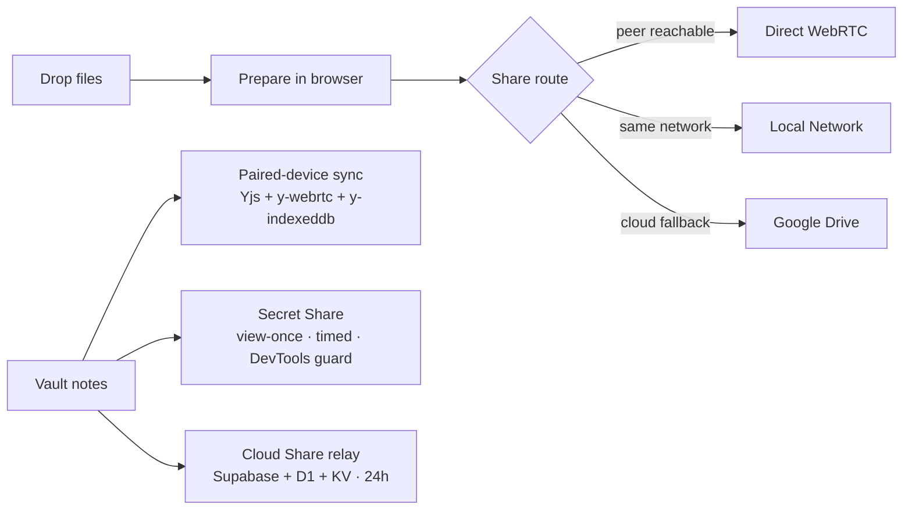

<!-- =====================================================================
     Clex · clex.in
     Drop. Prepare. Share. — A privacy-first browser workspace + Vault.
     ===================================================================== -->

<div align="center">


# 📦 Clex &nbsp;·&nbsp; **Drop. Prepare. Share.**

### A privacy-first browser workspace for file transfer and browser-native tools — plus **Vault** for encrypted notes, secret links, and timed relay handoffs.

<a href="https://clex.in"></a>
<a href="https://clex.in/workspace"></a>
<a href="https://clex.in/vault"></a>
<a href="https://clex.in/chain"></a>
<a href="https://signal.clex.in/health"></a>

<br />

<a href="https://github.com/Abhinavv-007/clex/stargazers"></a>
<a href="https://github.com/Abhinavv-007/clex/commits/main"></a>


<br />

<sub><b>Workspace · Vault · Chain · Signaling — one product system, four surfaces.</b></sub>

</div>

<br />

---

## ✦ Latest Update — Immersive Polish Pass (`v1.0.1-immersive`)

Cleanup + interactive elements pass on top of the existing immersive hero system. All additive — no existing motion removed.

- **Custom cursor follower** — 12px circle, `mix-blend-mode: difference`, rAF lerp, gated to `(hover: hover) and (pointer: fine)`
- **Scroll progress bar** — fixed top, `accent → accent-warm` gradient, rAF-driven width update
- **SVG turbulence noise grain** — body::after, 4% opacity, fixed, `pointer-events: none`
- **Mascot eyes track cursor** — pupils translate ±4px proportional to cursor delta from window center
- **Chunk grid wave stagger** — `--row` / `--col` driven via `ResizeObserver`, animation-delay maths off live grid
- **Counter pulse-glow** — animated number counters fire a `.pulse-glow` class on completion
- **Interactive polish** — nav-link hover glow underline, primary-button radial halo, card hover `z-index`, footer/social `scale + rotate`, focus-visible accent ring, peer-pipe packet `drop-shadow`, smooth section-divider fill transitions, floating-tag depth, bento-cell inner glow, DPC blob freeze on hover, accordion hover bg, hamburger hover, copy-button `data-loading` state, routing-card hover lift

All new motion respects `prefers-reduced-motion` and touch devices.

Release: <https://github.com/Abhinavv-007/clex/releases/tag/v1.0.1-immersive>

---

## ✦ Hero Reels

<table>
  <tr>
    <td width="50%" align="center">
      <a href="https://clex.in/workspace"></a>
      <p><b>Workspace</b> — drop, prepare, share.</p>
    </td>
    <td width="50%" align="center">
      <a href="https://clex.in/vault"></a>
      <p><b>Vault</b> — encrypted notes, secrets, cloud share.</p>
    </td>
  </tr>
  <tr>
    <td width="50%" align="center">
      <a href="https://clex.in/chain"></a>
      <p><b>Chain</b> — public transfer-chain explorer.</p>
    </td>
    <td width="50%" align="center">
      
      <p><b>Share Anywhere</b> — WebRTC, LAN, or Drive fallback.</p>
    </td>
  </tr>
</table>

---

## ✦ What Clex Ships

<table>
  <tr>
    <td width="50%" valign="top">
      <h3>🪂 Workspace</h3>
      <ul>
        <li>Drop files into one browser workspace.</li>
        <li>Run browser-side tools — image compression, format conversion, PDF merge/split, ZIP creation, and more.</li>
        <li>Share through direct <b>WebRTC</b>, same-network delivery, or <b>Google Drive</b> fallback.</li>
      </ul>
    </td>
    <td width="50%" valign="top">
      <h3>🗝 Vault</h3>
      <ul>
        <li>Encrypted notes, primarily on-device.</li>
        <li>Sync paired devices over the shared Vault room with manual sync.</li>
        <li>Secret links with selectable protections + timed expiry.</li>
        <li>Timed Cloud Share via QR, direct link, or relay code.</li>
      </ul>
    </td>
  </tr>
  <tr>
    <td width="50%" valign="top">
      <h3>🔗 Chain</h3>
      <p>Public, append-only transfer-chain explorer of <i>workspace</i> transfer metadata. Handy for sharing receipts of "yes, this got delivered" without exposing the file content.</p>
    </td>
    <td width="50%" valign="top">
      <h3>🌐 Public Site</h3>
      <p>Landing, features, how-it-works, getting-started, chain, FAQ, privacy, and terms — all in the same frontend and visual system.</p>
    </td>
  </tr>
</table>

---

## ✦ Product Surfaces

| Route | Purpose |
| --- | --- |
| `/` | Marketing landing page |
| `/workspace` | Main file workspace |
| `/receive` | Receive flow for shared files |
| `/vault` | Vault app shell |
| `/vault/secret` | Secret reveal page |
| `/vault/share` | Timed file receive page |
| `/features` | Feature overview |
| `/how-it-works` | Transfer + Vault walkthrough |
| `/getting-started` | Onboarding flow |
| `/chain` | Public transfer-chain explorer |
| `/faq` · `/privacy` · `/terms` | Product FAQ + legal |

Production:
- Marketing + app: [clex.in](https://clex.in)
- Workspace: [clex.in/workspace](https://clex.in/workspace)
- Vault: [clex.in/vault](https://clex.in/vault)
- Receive: [clex.in/receive](https://clex.in/receive)
- Chain: [clex.in/chain](https://clex.in/chain)
- Signaling health: [signal.clex.in/health](https://signal.clex.in/health)

---

## ✦ Workspace + Vault Model



Important boundaries:
- Workspace transfers avoid server-side file storage whenever possible.
- Vault notes are local-first and encrypted before persistence.
- Vault secret payloads are encrypted client-side; the key stays in the URL fragment or reveal code.
- Vault Cloud Share is the exception: timed relay backed by Supabase storage + Cloudflare Worker metadata.
- The public Transfer Chain is for workspace transfer metadata — **not** Vault note content or Vault secret/file payloads.

---

## ✦ Vault Limits & Behaviour

- Notes stored locally; encrypted before persistence.
- Paired devices sync through the shared Vault room when both are online.
- Secret Share supports timed expiry plus selectable protections: **view-once**, **timed view**, **no-select**, **tab-switch lock**, **DevTools guard**, **screenshot guard**.
- Cloud Share currently uses:
  - `10 MB` max per file
  - `100 MB` per user per day
  - `24h` auto-delete
  - Google sign-in for ownership and quota enforcement

---

## ✦ Tech Stack

<p>
  
  
  
  
  
  <br/>
  
  
  
  
  
  
</p>

---

## ✦ Monorepo Layout

```text
.
├── frontend-2/                # MPA frontend shipped to clex.in
├── packages/frontend-core/    # Shared Svelte runtime, workspace, Vault, landing
├── apps/api/                  # Google Drive auth/upload worker
├── apps/signaling/            # WebRTC signaling worker
├── apps/chain/                # Public transfer-chain worker
├── apps/vault-worker/         # Vault API: secrets, pairing, relay files, health
├── archive/old-frontend/      # Archived legacy frontend reference
├── clex-mobile/, docs/
├── pnpm-workspace.yaml, package.json
└── vitest.config.ts
```

---

## ✦ Requirements

- Node.js `>=20`
- pnpm `>=9`

```bash
pnpm install
```

---

## ✦ Local Development

```bash
# everything in parallel: frontend + signaling + api + chain
pnpm dev

# focused
pnpm dev:frontend
pnpm dev:web
pnpm dev:signal
pnpm dev:api
pnpm dev:chain

# Vault worker (separate)
pnpm --filter @clex/vault-worker dev
```

Frontend env:

```bash
cp frontend-2/.env.example frontend-2/.env.local
```

Default local ports:

| Surface | Port |
| --- | --- |
| Frontend | `3000` |
| Signaling worker | `8787` |
| API worker | `8788` |
| Chain worker | `8789` |

> Vault locally: the UI is served by `frontend-2`, but its secret, pairing, and Cloud Share APIs live in `apps/vault-worker`. The frontend expects Vault APIs on `/vault/api/*` in production. For full local Vault flows, run the Vault worker and route `/vault/api/*` to it.

---

## ✦ Build & Verification

```bash
pnpm build
pnpm test
pnpm typecheck

pnpm --filter @clex/frontend build
pnpm --filter @clex/frontend-core typecheck
pnpm --filter @clex/vault-worker exec tsc --noEmit
```

Worker-specific:

```bash
pnpm --filter @clex/vault-worker build
pnpm --filter @clex/vault-worker deploy
pnpm --filter @clex/vault-worker db:migrate
```

---

## ✦ Deployment

- `frontend-2` builds the static site and app shell.
- `apps/signaling`, `apps/api`, `apps/chain`, and `apps/vault-worker` deploy independently as Cloudflare Workers.
- The Vault worker is expected to serve `/vault/api/*` on production.
- Vault Cloud Share requires Supabase secrets and storage bucket configuration in the worker environment.

Vault worker bindings include:

- **KV** for secrets, pairing signals, tokens, and daily quotas
- **D1** for relay metadata and pending deletions
- **Supabase secrets** for timed file relay storage

---

## ✦ Why This Repo Exists

> Clex is meant to feel like one product system, not a pile of separate demos:
> - the landing site and the apps share the same visual language;
> - the workspace and Vault sit in the same frontend shell;
> - transfer routes and Vault flows are treated as product surfaces, not side experiments;
> - the backend stays narrow and task-specific.

Fastest way to understand the repo:

1. Open [clex.in](https://clex.in)
2. Try the Workspace at `/workspace`
3. Try Vault at `/vault`
4. Look at `packages/frontend-core` for shared runtime logic
5. Look at `apps/*` for the deployment surfaces behind each product capability

---

## ✦ Sister Projects

| Repo | Platform |
| --- | --- |
| [`clex-android`](https://github.com/Abhinavv-007/clex-android) | Native Android app |
| [`clex-ios`](https://github.com/Abhinavv-007/clex-ios) | Native SwiftUI iOS app |
| [`clex-ai`](https://github.com/Abhinavv-007/clex-ai) | OpenAI-compatible AI gateway |

---

## ✦ Star History

<a href="https://star-history.com/#Abhinavv-007/clex&Date">
  
</a>

---

<div align="center">
  <sub>📦 Built by <a href="https://abhnv.in"><b>Abhinav Raj</b></a> — privacy-first by design.</sub>
  <br/>
  <a href="https://abhnv.in">Portfolio</a> · <a href="https://www.linkedin.com/in/abhnv8/">LinkedIn</a> · <a href="https://x.com/Abhnv8">X</a> · <a href="https://www.instagram.com/abhnv08/">Instagram</a>
</div>
