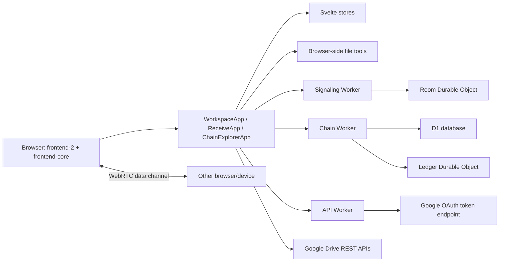
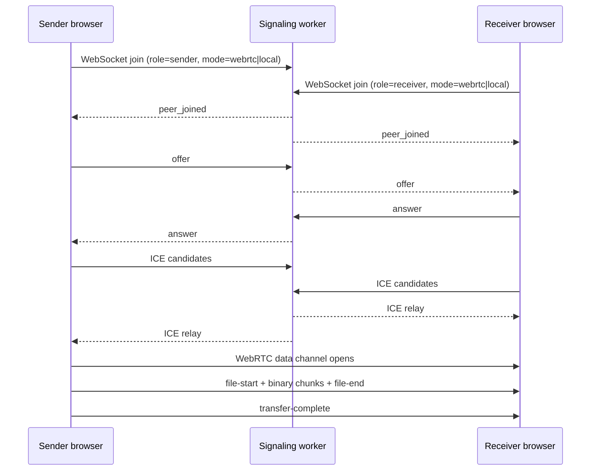
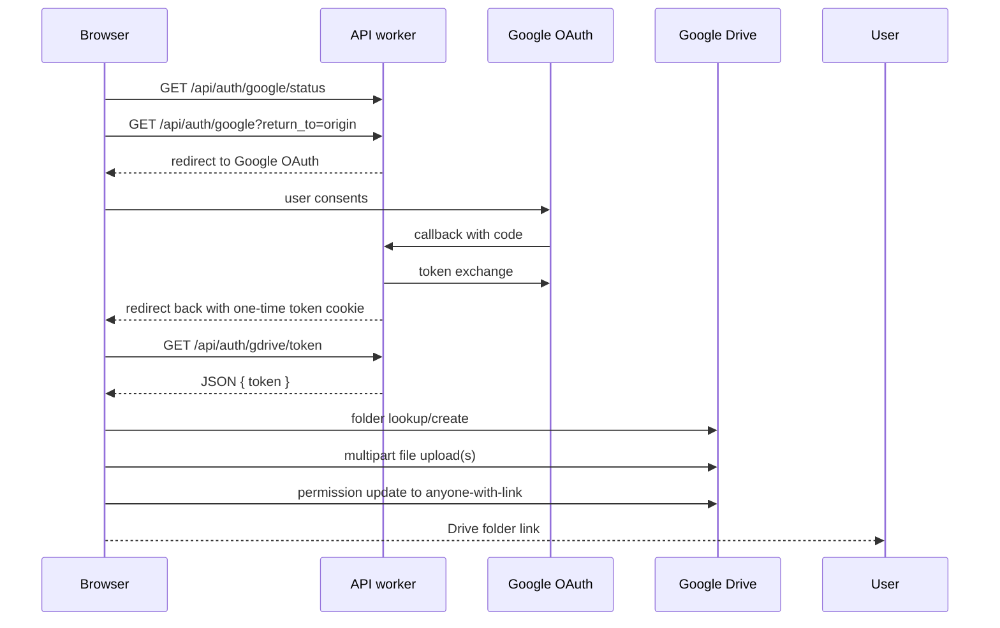

# Clex System Guide

This document describes how the current Clex codebase works today. It is written in two layers:

- first as a plain-language product guide
- then as a technical map of the runtime, APIs, state, and network flows

It reflects the repository as inspected in code, not only what the marketing copy says.

## 1. What Clex Is

At a product level, Clex is a browser-based file workspace with three jobs:

1. collect files in one place
2. prepare them in the browser with built-in tools
3. share them through one of three routes: direct browser-to-browser, same-network browser-to-browser, or Google Drive

The important product promise is privacy-first transfer:

- for direct and local transfers, file bytes move between browsers over WebRTC
- the signaling server helps the two browsers find each other, but it does not relay file contents
- Google Drive is the explicit cloud fallback, and the files go into the user's own Drive account

If you only remember four things, remember these:

- `frontend-2` is the primary shipped site
- `packages/frontend-core` contains the real workspace, transfer, tool, and shared UI logic
- `apps/signaling`, `apps/api`, and `apps/chain` are small purpose-built workers behind the frontend
- `archive/old-frontend/apps-web` is a legacy SvelteKit reference, not an active surface
- there are two different meanings of "chain" in this repo: tool suggestions and the public transfer ledger

## 2. Repo Map

| Path | Role | What it really does |
| --- | --- | --- |
| `frontend-2/` | Primary shipped frontend | Vite multi-page site for `clex.in`; static HTML shells plus mounted Svelte islands |
| `packages/frontend-core/` | Shared runtime core | Workspace app, receive app, chain explorer, stores, transfer code, tools, utilities, shared components |
| `apps/signaling/` | WebRTC signaling worker | Cloudflare Worker + Durable Object room server for SDP/ICE exchange and room lifecycle |
| `apps/api/` | Google auth worker | Starts OAuth, handles callback, exchanges code for token, exposes one-time token pickup |
| `apps/chain/` | Public ledger worker | D1-backed transfer session API plus a Durable Object append-only hash ledger |
| `archive/old-frontend/apps-web/` | Archived legacy frontend | Preserved SvelteKit implementation kept only as reference during cleanup |

### Legacy frontend note

The production-oriented path in this repo is `frontend-2` plus `packages/frontend-core`.

The older SvelteKit implementation has been moved to `archive/old-frontend/apps-web` so it remains available for reference without participating in active scripts, workspace resolution, or publishable build paths.

## 3. Shipped Runtime Model

### Primary runtime: `frontend-2` + `packages/frontend-core`

The production frontend is split into two layers:

- `frontend-2` provides page shells, route rewrites, CSS, navigation, page-specific scripts, and island mount points
- `packages/frontend-core` provides the actual interactive Svelte apps and shared business logic

The startup flow is:

1. a page in `frontend-2` loads
2. the HTML `<body>` carries a `data-page` attribute such as `home`, `workspace`, `receive`, or `chain`
3. `frontend-2/js/main.js` initializes theme, nav, Google Drive OAuth cleanup, and then calls `initIslands()`
4. `frontend-2/js/islands.js` looks at `data-page` and mounts the correct Svelte component from `@clex/frontend-core`

### What `js/main.js` does

`frontend-2/js/main.js` is the browser entrypoint. It:

- loads shared frontend-core styles
- initializes theme and nav behavior
- handles Google Drive OAuth callback cleanup by calling `pickupToken()`
- mounts page islands
- lazy-loads animations afterward

That means Google Drive token pickup is treated as a global page concern, not only a workspace concern.

### How page selection works

The page shell decides what mounts by `data-page`:

| `data-page` | Mounted behavior |
| --- | --- |
| `home` | marketing page plus mock/demo islands from frontend-core |
| `features` | static content plus a chain-flow mock island |
| `how-it-works` | static content plus demo islands |
| `workspace` | mounts `WorkspaceApp` |
| `receive` | mounts `ReceiveApp` |
| `chain` | mounts `ChainExplorerApp` |
| `getting-started`, `faq`, `privacy`, `terms` | mostly static pages, no main application runtime |

### Route model in the primary frontend

`frontend-2` is a Vite multi-page app with custom slashless route rewriting:

- `/` maps to `index.html`
- `/workspace` maps to `workspace/index.html`
- `/receive` maps to `receive/index.html`
- `/chain` maps to `chain/index.html`
- other content pages follow the same directory pattern

The route rewrite plugin makes clean URLs work in dev and preview, even though the source is multi-page HTML.

### Archived/reference frontend: `archive/old-frontend/apps-web`

`archive/old-frontend/apps-web` is the older SvelteKit app that overlaps heavily with the shipped frontend:

- it has routes like `/workspace`, `/receive/[code]`, `/chain`, and content pages
- it contains duplicate copies of stores, transfer modules, tool code, and components
- it also includes its own Google auth endpoints under `src/routes/api/auth/...`

In practical terms:

- `frontend-2` is the main product surface to explain first
- the archived SvelteKit code is useful as historical reference only
- active development and publishable builds should ignore the archived frontend

## 4. Architecture At A Glance



### High-level responsibility split

- the browser handles file selection, previews, tool execution, transfer state, WebRTC, Drive upload, and receive-side save UX
- `apps/signaling` only brokers WebRTC negotiation and room presence
- `apps/api` only handles Google OAuth initiation, callback, and one-time token pickup
- `apps/chain` stores anonymous transfer metadata and hash-links transfer sessions
- Google Drive stores the actual file bytes only when the user chooses the Drive route

## 5. End-to-End File Lifecycle

This section follows the main user journey from first load to final delivery.

### 5.1 Workspace boot

When `/workspace` loads in the primary frontend:

- `frontend-2/workspace/index.html` provides the shell
- `frontend-2/js/islands.js` mounts `WorkspaceApp`
- `WorkspaceApp` renders four main areas:
  - `FileList`
  - `ToolChain`
  - `SharePanel`
  - `ReceiveAccessCard`
- `WorkspaceApp` also creates a chain client and starts chain instrumentation on mount

So the workspace is not just a visual page. It also wires the ledger observer immediately.

### 5.2 Files enter the app

Files are added through `FileDropzone` and stored in `filesStore`.

`filesStore` creates one `FileEntry` per input file with:

- a generated `id`
- the original `File`
- `name`, `size`, `type`
- an image `previewUrl` if the file is an image
- an optional `processed` field for transformed outputs

Important behavior:

- images get preview object URLs
- removing or clearing files revokes object URLs
- the workspace file list is the canonical source for what can be shared

### 5.3 Prepare flow: browser-side tools

The `ToolChain` panel chooses available tools based on current file MIME/category and then runs the selected tool entirely in the browser.

#### Tool inventory

| Tool | Source module | Main library / browser primitive | Output |
| --- | --- | --- | --- |
| Image compress | `imageCompress.ts` | `browser-image-compression` | compressed image blob |
| Image convert | `imageConvert.ts` | `createImageBitmap` + `OffscreenCanvas` | converted image blob |
| PDF merge | `pdfMerge.ts` | `pdf-lib` | one merged PDF |
| PDF split | `pdfSplit.ts` | `pdf-lib` | one PDF per page, then zipped |
| PDF to image | `pdfToImage.ts` | `pdfjs-dist` + canvas | one or more images; multiple pages become ZIP |
| Word to PDF | `wordToPdf.ts` | `mammoth` -> `html2canvas` -> `jsPDF` | PDF blob |
| ZIP | `zip.ts` | `JSZip` | ZIP blob |

#### Prepare flow, step by step

1. user selects a tool in `ToolChain`
2. `toolsStore.startTool()` marks the tool as active and resets prior result state
3. `ToolChain.svelte` dynamically imports the tool module and runs it
4. progress updates are pushed into `toolsStore`
5. the result is stored in `toolsStore.result` with:
   - `outputBlob`
   - `outputName`
   - `outputType`
   - `outputUrl`
   - follow-up suggestions from `getSuggestions()`
6. `ToolResult` shows the output and lets the user download it or jump to the next suggestion

#### What "tool chain" means in code

In the current primary runtime, tool chaining is mostly suggestion-driven:

- the result panel suggests what to do next
- those suggestions can either run another tool or move the user to the share panel
- the output is not clearly promoted back into the workspace file list as the new canonical file set

That distinction matters and is called out again in [Observed Gaps / Reality Checks](#11-observed-gaps--reality-checks).

### 5.4 Share route selection

The `SharePanel` is controlled by `transferStore.method`, which can be:

- `webrtc`
- `local`
- `drive`

The UI exposes these as tabs:

- Direct
- Local
- Drive

Switching method tabs resets transfer progress/errors and starts a fresh share state.

### 5.5 Direct and local transfers

Direct and local sharing both use the same `WebRTCTransfer` class. The difference is the ICE configuration.

#### Room setup

- `transferStore` generates a room code up front
- `ReceiveAccessCard` turns that code into a receiver URL
- the primary frontend uses query-style receive links:
  - `/receive?code=ABC123&mode=webrtc`
  - `/receive?code=ABC123&mode=local`
- the archived SvelteKit reference also supports segment-style receive routes:
  - `/receive/ABC123?mode=webrtc`

#### Signaling path

- `DirectShare` creates `WebRTCTransfer(signalingUrl, roomCode, 'sender', profile)`
- `ReceiveApp` creates `WebRTCTransfer(signalingUrl, roomCode, 'receiver', profile)`
- both sides connect to the signaling worker over WebSocket

The sender waits until the room becomes complete and then creates the offer.

#### Transfer sequence



#### How file sending works internally

`WebRTCTransfer` does the actual payload movement:

- sender creates one ordered data channel labeled `clex-transfer`
- each file is read into an `ArrayBuffer`
- payload is split into 64 KB chunks
- control messages are JSON:
  - `file-start`
  - `file-end`
  - `transfer-complete`
- binary chunks are sent between those control messages
- backpressure is handled by watching `RTCDataChannel.bufferedAmount`

On the receiver side:

- chunks are buffered in memory per file
- `file-end` causes the receiver to assemble a Blob
- the receiver adds that Blob to `transferStore.receivedFiles`
- the code also auto-clicks a temporary download anchor for that file

### 5.6 Receive-side behavior across devices

`ReceiveApp` is designed to work on both desktop and mobile browsers.

Receive flow:

1. the receiver opens the link or enters a 6-character room code
2. the app can auto-connect if the code is present in the URL
3. during transfer, progress, speed, ETA, and current file are shown
4. after completion:
   - the browser may already have saved the files through auto-download
   - manual save controls stay visible

Save behavior depends on browser capabilities:

- if `navigator.share()` with file sharing is available, `saveBlobWithSystemFallback()` can hand the file to the system share sheet
- otherwise the app falls back to standard browser download
- if multiple files were received and the user chooses "Save all", the app re-zips them and saves the ZIP

That means mobile and desktop both use the same browser runtime, but the final save handoff can differ.

### 5.7 Google Drive fallback

Drive mode is different from direct/local mode in one important way:

- the Clex API worker handles OAuth
- the browser uploads the files directly to Google Drive
- the Clex API worker does not proxy the file bytes

#### OAuth and upload flow



#### Step-by-step behavior

1. `DriveShare` checks whether an access token already exists in browser storage
2. if not, it calls `initiateGoogleAuth()`
3. before redirecting, the browser persists the current files and transfer method in IndexedDB so the workspace can be restored after OAuth
4. `apps/api` starts OAuth and stores short-lived state cookies
5. on callback, `apps/api` exchanges the code for an access token and stores that token in a short-lived HTTP-only cookie
6. `pickupToken()` reads the one-time token from `/api/auth/gdrive/token`, stores it in browser storage, and restores pending workspace state
7. `uploadToDrive()` ensures the root folder `Glex sharing` exists, creates a timestamped child folder, uploads files, sets "anyone with link" permission on the folder, and returns the folder URL

#### Where files go in Drive mode

Files go into:

- a root folder named `Glex sharing`
- then a timestamped session folder inside it

The share result is the Google Drive folder link, not a Clex-hosted link.

## 6. Networking and Routing

### Route types in the product

| Product label | Internal method/profile | Transport | Notes |
| --- | --- | --- | --- |
| Direct | `method='webrtc'`, `profile='webrtc'` | WebRTC + STUN | general browser-to-browser route |
| Local | `method='local'`, `profile='local'` | WebRTC without STUN | intended for same-network peers only |
| Drive | `method='drive'` | HTTPS to Google APIs | cloud fallback, no signaling room needed |

### What local mode really means

Local mode is not a separate LAN file server and not a custom local socket protocol.

In code, local mode means:

- `getRTCConfig('local')` returns `iceServers: []`
- the browsers try to connect using host-only ICE candidates
- after connection, Clex checks the selected ICE candidate pair
- if the connection looks like `internet` instead of `lan`, the transfer fails with a local-mode-specific message

So "local network" in the product copy really means "host-only WebRTC on the same network."

### What direct mode really means

Direct mode is still WebRTC, but with STUN servers configured.

By default, the frontend uses:

- `stun:stun.l.google.com:19302`
- `stun:stun.cloudflare.com:3478`

These come from `PUBLIC_STUN_SERVERS` or the built-in defaults.

There is no TURN server path in the current code.

That means:

- Clex can discover public/reflexive candidates through STUN
- but it does not have a relay fallback for restrictive networks
- if direct connection fails, the UX pushes the user toward Drive

### How Clex decides whether a connection is local or internet

After WebRTC connects, `getConnectionKindFromStats()` inspects the selected candidate pair:

- if any selected candidate type is `srflx`, the connection is treated as `internet`
- if the selected pair is all `host` or `prflx`, the connection is treated as `lan`
- otherwise the connection kind is `unknown`

This classification drives:

- the "Same network" / `nearby` signal
- local-mode acceptance or failure

### Signaling worker behavior

The signaling service is a Cloudflare Worker backed by a Durable Object room class.

Each room:

- is keyed by the 6-character room code
- allows one sender and one receiver
- stores the room mode (`webrtc` or `local`)
- relays only:
  - offers
  - answers
  - ICE candidates
  - heartbeat ping/pong
- expires after 30 minutes of inactivity

When both peers are present, both receive `peer_joined`.

## 7. Chain: Two Meanings

The word "chain" appears in two different product concepts.

### 7.1 Tool chain

This is the workspace concept:

- after a tool finishes, the UI suggests a next action
- examples:
  - PDF -> split or export as images
  - image -> compress or convert
  - archive -> share now

This chain is about workflow suggestions, not public audit data.

### 7.2 Transfer ledger chain

This is the public audit concept in `apps/chain`.

It has three key pieces:

1. a browser-generated local chain ID
2. a D1-backed session/event store
3. a Durable Object append-only hash chain

#### Chain ID model

`getChainId()`:

- generates 16 random bytes in the browser
- stores them as 32 hex characters in `localStorage`
- does not use IP, fingerprinting, or account identity

#### Session creation model

When the workspace mounts, it starts chain instrumentation.

That instrumentation:

- eagerly registers the local chain ID with `/chain/register`
- subscribes to `transferStore`
- on a transfer entering `waiting_peer`, it:
  - hashes each file blob with SHA-256
  - classifies file categories
  - creates a transfer session via `/chain/session`
  - appends an initial `waiting_peer` event
- on later transfer state changes, it appends more events

The chain layer is deliberately non-blocking:

- if the chain API fails, transfers keep working
- errors are swallowed inside the client

#### D1 schema

| Table | Purpose | Important columns |
| --- | --- | --- |
| `chain_ids` | known browser chain identities | `id`, `first_seen`, `last_seen` |
| `transfer_sessions` | one row per transfer session | sender/receiver chain IDs, route, file metadata JSON, status, timestamps, ledger hashes |
| `transfer_events` | session timeline | `session_id`, `status`, `ts` |

The ledger never stores:

- filenames
- file contents
- IP addresses

It stores:

- file category
- MIME type
- byte size
- content hash

#### Durable Object hash chain

The `ChainLedger` Durable Object maintains a global append-only chain.

For each appended record it computes:

- `ledger_index`
- `previous_hash`
- `record_hash = SHA-256(ledger_index + ":" + previous_hash + ":" + data)`

Because the Durable Object is single-threaded, concurrent writes are serialized naturally.

#### Explorer page

The `/chain` page mounts `ChainExplorerApp`, which:

- loads stats and paginated recent sessions
- auto-refreshes every 30 seconds
- can expand a session to show:
  - prior/current hash
  - file metadata rows
  - event timeline

The explorer also registers the browser's current chain ID on mount.

## 8. API and Protocol Catalog

### 8.1 "Who calls what" summary

| Caller | Destination | Protocol | Purpose |
| --- | --- | --- | --- |
| browser transfer UI | signaling worker | WebSocket | room join and SDP/ICE relay |
| `SignalingClient` error handling | signaling `/health` | HTTP GET | connectivity diagnosis when WebSocket join fails |
| chain instrumentation / explorer | chain worker | HTTP JSON | register IDs, create sessions, append events, read explorer data |
| Drive auth code | API worker | HTTP GET + redirects | OAuth setup and one-time token pickup |
| API worker | Google OAuth token endpoint | HTTP POST | exchange auth code for access token |
| browser Drive upload code | Google Drive REST APIs | HTTP fetch + XHR | create folders, upload files, set permissions |

### 8.2 Signaling worker routes

Base service: `apps/signaling`

| Route | Method | Purpose | Notes |
| --- | --- | --- | --- |
| `/health` | `GET` | health check | used by `SignalingClient` when a WebSocket join fails |
| `/room/:code?role=...&mode=...` | WebSocket upgrade | join a room and relay negotiation messages | `:code` must be 6 alphanumeric characters |

#### WebSocket query parameters

| Param | Required | Values | Meaning |
| --- | --- | --- | --- |
| `role` | yes | `sender`, `receiver` | which peer is joining |
| `mode` | no | `webrtc`, `local` | requested room mode; first valid join wins |

#### Client -> signaling messages

| Type | Shape | Meaning |
| --- | --- | --- |
| `offer` | `{ type: 'offer', sdp }` | sender SDP offer |
| `answer` | `{ type: 'answer', sdp }` | receiver SDP answer |
| `ice` | `{ type: 'ice', candidate }` | ICE candidate relay |
| `ping` | `{ type: 'ping' }` | keepalive heartbeat |

`candidate` is shaped as:

```ts
{
  candidate: string
  sdpMid?: string | null
  sdpMLineIndex?: number | null
  usernameFragment?: string | null
}
```

#### Signaling -> client messages

| Type | Shape | Meaning |
| --- | --- | --- |
| `joined` | `{ type: 'joined', role, mode }` | confirms room join and active room mode |
| `peer_joined` | `{ type: 'peer_joined', mode }` | both peers are now present |
| `offer` | `{ type: 'offer', sdp }` | relayed offer |
| `answer` | `{ type: 'answer', sdp }` | relayed answer |
| `ice` | `{ type: 'ice', candidate }` | relayed ICE candidate |
| `peer_left` | `{ type: 'peer_left' }` | the other side disconnected |
| `error` | `{ type: 'error', code }` | room/protocol error |
| `pong` | `{ type: 'pong' }` | keepalive reply |

Known room error codes in the service types:

- `ROOM_FULL`
- `INVALID_ROLE`
- `NO_PEER`

### 8.3 API worker routes

Base service: `apps/api`

| Route | Method | Purpose | Notes |
| --- | --- | --- | --- |
| `/api/auth/google/status` | `GET` | tells the browser whether OAuth is configured | returns `{ configured, missing }` |
| `/api/auth/google` | `GET` | starts Google OAuth | accepts optional `return_to` |
| `/api/auth/google/callback` | `GET` | handles Google callback and code exchange | sets short-lived one-time token cookie |
| `/api/auth/gdrive/token` | `GET` | returns the one-time token and clears its cookie | called with credentials included |

#### Important API worker cookies

| Cookie | Purpose |
| --- | --- |
| `gdrive_state` | CSRF/state validation during OAuth |
| `gdrive_return_to` | frontend origin to redirect back to |
| `gdrive_token_once` | one-time access token pickup |

### 8.4 Chain worker routes

Base service: `apps/chain`

| Route | Method | Purpose | Response shape |
| --- | --- | --- | --- |
| `/chain/register` | `POST` | register a chain ID | `{ ok: true }` |
| `/chain/session` | `POST` | create a transfer session | `{ session_id, ledger_index }` |
| `/chain/session/:id/event` | `POST` | append a transfer event | `{ ok: true }` |
| `/chain/explorer` | `GET` | paginated session list | `{ sessions, total, page, limit }` |
| `/chain/session/:id` | `GET` | single session detail | session row plus `events` |
| `/chain/chains` | `GET` | paginated chain ID list | `{ chains, total, page, limit }` |
| `/chain/stats` | `GET` | aggregate counts | `{ total_sessions, total_chains, completed_sessions }` |
| `/chain/health` | `GET` | health check | `{ ok: true }` |

#### `POST /chain/register`

Request:

```json
{ "chain_id": "32 hex chars" }
```

#### `POST /chain/session`

Request:

```json
{
  "sender_chain_id": "32 hex chars",
  "route": "webrtc | local | drive",
  "files": [
    {
      "category": "image | pdf | document | archive | video | audio | other",
      "type": "mime/type",
      "size": 12345,
      "hash": "64 hex chars"
    }
  ]
}
```

#### `POST /chain/session/:id/event`

Request:

```json
{
  "status": "registered | waiting_peer | connecting | transferring | completed | cancelled | failed | abandoned",
  "receiver_chain_id": "optional 32 hex chars"
}
```

### 8.5 External APIs used by Clex

| External service | Endpoint pattern | Used by | Purpose |
| --- | --- | --- | --- |
| Google OAuth | `https://accounts.google.com/o/oauth2/v2/auth` | API worker | begin OAuth |
| Google OAuth token exchange | `https://oauth2.googleapis.com/token` | API worker | exchange code for access token |
| Google Drive files API | `https://www.googleapis.com/drive/v3/files` | browser | folder lookup/create |
| Google Drive upload API | `https://www.googleapis.com/upload/drive/v3/files?uploadType=multipart` | browser | upload file bytes |
| Google Drive permissions API | `https://www.googleapis.com/drive/v3/files/:id/permissions` | browser | grant anyone-with-link reader access |

## 9. Runtime State and Internal Contracts

### Shared stores

| Store | Purpose | Key state |
| --- | --- | --- |
| `filesStore` | current workspace file set | original `File`, preview URL, optional processed payload |
| `toolsStore` | active tool run and last tool result | active tool, progress, result, error |
| `transferStore` | active share/receive session | route, room code, transfer state, progress, speed, received files, Drive link |
| `uiStore` | workspace panel and toast UI | active panel, toast queue, modal state |

### Transfer state machine

`transferStore.state` can be:

| State | Meaning |
| --- | --- |
| `idle` | no active transfer |
| `preparing` | sender/receiver is initializing transfer objects |
| `waiting_peer` | room joined, waiting for other side |
| `connecting` | SDP/ICE negotiation in progress |
| `transferring` | data channel open and bytes are moving |
| `complete` | transfer or Drive upload finished |
| `failed` | transfer failed |

### Room code and receive URL formats

There are two receive URL styles in the repo:

| Frontend surface | URL style |
| --- | --- |
| `frontend-2` primary runtime | `/receive?code=ABC123&mode=webrtc` |
| `archive/old-frontend/apps-web` reference | `/receive/ABC123?mode=webrtc` |

### Chain record shape

The chain worker stores transfer file records in `files_json` as sanitized metadata:

- `category`
- `type`
- `size`
- `hash`

Filenames are deliberately excluded.

## 10. Deployment and Config

### Production hosts

| Host/path | Service |
| --- | --- |
| `https://clex.in` | primary site/frontend |
| `https://www.clex.in` | alternate frontend host |
| `https://signal.clex.in` | signaling worker custom domain |
| `https://clex.in/api/*` | API worker routes |
| `https://clex.in/chain/*` | chain worker routes |

### Local dev ports visible in this repo

| Service | Local command | Default/local port |
| --- | --- | --- |
| `frontend-2` | `pnpm dev:frontend` | `3000` |
| `apps/signaling` | `pnpm dev:signal` | `8787` |
| `apps/api` | `pnpm dev:api` | `8788` |
| `apps/chain` | `pnpm dev:chain` | `8789` |

`pnpm dev:web` remains as a compatibility alias and starts the same `frontend-2` dev server on `3000`.

### Important frontend-facing environment variables

| Variable | Used by | Meaning |
| --- | --- | --- |
| `PUBLIC_SIGNALING_URL` | direct/local transfer code | WebSocket base URL for signaling |
| `PUBLIC_STUN_SERVERS` | WebRTC config | comma-separated STUN list for direct mode |
| `PUBLIC_API_BASE_URL` | Drive auth/upload code in frontend-core | API worker base URL; empty string means same origin |
| `PUBLIC_CHAIN_URL` | workspace and chain explorer mounts in `frontend-2` | chain worker base URL; empty string means same origin |

### Google OAuth and API worker configuration

| Variable | Service | Meaning |
| --- | --- | --- |
| `GOOGLE_CLIENT_ID` | API worker | OAuth client ID |
| `GOOGLE_CLIENT_SECRET` | API worker | OAuth client secret |
| `GOOGLE_REDIRECT_URI` | API worker | exact callback URL registered with Google |
| `GOOGLE_DRIVE_SCOPE` | API worker | scope, default `https://www.googleapis.com/auth/drive.file` |
| `ALLOWED_ORIGIN` | workers | CORS allowlist |
| `FRONTEND_BASE_URL` | API worker | fallback frontend base for post-auth redirect |

### Important local/prod config nuance

- in the primary frontend, `PUBLIC_API_BASE_URL` and `PUBLIC_CHAIN_URL` are supported by code but not listed in the checked-in `.env.example` files
- for production same-origin routing, empty string works because the frontend can call `/api/...` and `/chain/...` directly on `clex.in`
- for local `frontend-2` development, those base URLs often need to be set explicitly so calls go to ports `8788` and `8789` instead of the frontend dev server

## 11. Observed Gaps / Reality Checks

This section is the most important one for anyone trying to understand what is implemented versus what is implied.

### 11.1 "Smart routing" is mostly product copy today

The real workspace does not automatically pick a route for the user.

What the code actually does:

- the share panel exposes manual tabs for Direct, Local, and Drive
- the default is Direct (`webrtc`)
- local/internet classification happens after WebRTC stats are available
- `nearby` is a post-connection signal, not a true pre-transfer route planner

So the marketing language about Clex "finding the fastest route" is ahead of the actual workspace behavior.

### 11.2 "Tool chaining" is suggestion-led, not state-promoted

The UI strongly implies that one tool's output becomes the next tool's input inside the workspace.

What the primary runtime actually does:

- tools write results into `toolsStore.result`
- `ToolResult` lets the user download that output or choose a suggested next step
- `filesStore.setProcessed()` exists, and share flows are written to prefer `processed?.blob`
- but the main `ToolChain.svelte` path does not clearly write the tool result back into `filesStore`

That means current chaining is closer to:

- "Here is the output, and here is what you might do next"

than to:

- "The workspace file set has now advanced to the next stage of the chain"

### 11.3 The ledger does not currently capture the receiver chain ID in the main flow

The chain API supports `receiver_chain_id` on event append, but the primary chain instrumentation never supplies it.

In practice:

- sender-side workspace activity creates the session
- receiver-side `ReceiveApp` is not instrumented with the chain observer
- `receiver_chain_id` is therefore likely to remain `null` in normal usage

The explorer UI has a receiver column, but the current main flow does not fully populate it.

### 11.4 Opening the chain page can register a chain ID even without a transfer

`ChainExplorerApp` calls `client.register(myChainId)` on mount.

That means:

- browsing `/chain` can create a chain ID record
- `total_chains` is not a pure "number of transfer participants" metric
- it can also include browsers that only visited the explorer

### 11.5 "Local network" is not a separate LAN transport

The product copy may sound like there is a distinct local-network transfer engine.

In code, local mode is:

- the same WebRTC transfer engine
- but with zero STUN servers
- and a post-connect check that rejects non-LAN candidate pairs

That is an important difference for debugging, expectations, and future feature work.

### 11.6 There is no TURN fallback

Direct mode uses STUN only.

So:

- restrictive NAT/firewall combinations can still fail
- Clex has no relay server path in the current code
- the practical fallback is Google Drive, not TURN

### 11.7 The primary frontend needs more explicit local config documentation

The shipped runtime reads:

- `PUBLIC_API_BASE_URL`
- `PUBLIC_CHAIN_URL`

but the checked-in env examples document only `PUBLIC_SIGNALING_URL` and `PUBLIC_STUN_SERVERS`.

This makes local setup less obvious than it should be, especially when `frontend-2` runs on `3000` and the workers run on `8787`, `8788`, and `8789`.

### 11.8 There are two frontend implementations with overlapping responsibilities

This is still a useful maintenance fact, but only one frontend is active now:

- `frontend-2` is the primary shipped site
- `archive/old-frontend/apps-web` preserves the older SvelteKit implementation
- the archived frontend still contains overlapping UI, transfer, and auth code for reference

Anyone maintaining the repo should treat frontend behavior changes as single-surface work unless they are explicitly consulting or reviving the archived reference.

## 12. Practical Mental Model

If you want the shortest technically accurate mental model of Clex, it is this:

- the website is a static multi-page shell that mounts shared Svelte apps where interactivity matters
- the workspace keeps files in browser memory/state, runs file transformations locally, and then sends or uploads them
- direct and local transfer are both WebRTC; local is just the stricter host-only profile
- signaling only helps browsers negotiate the peer connection
- Google Drive mode uses Clex only for OAuth; the browser talks to Drive directly for the actual upload
- the public chain is an anonymous metadata ledger, not a file storage layer

That is the current system.
